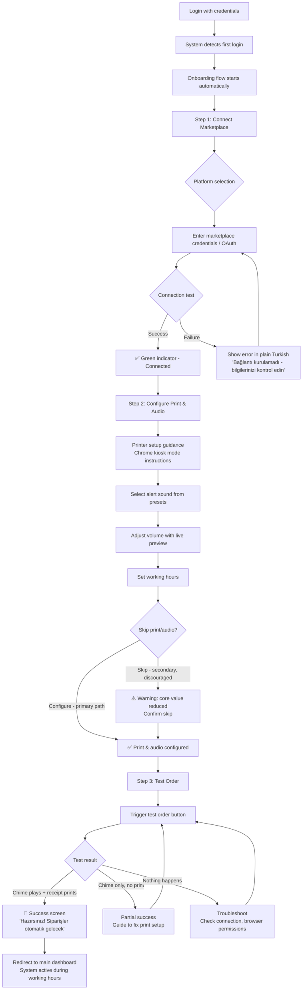
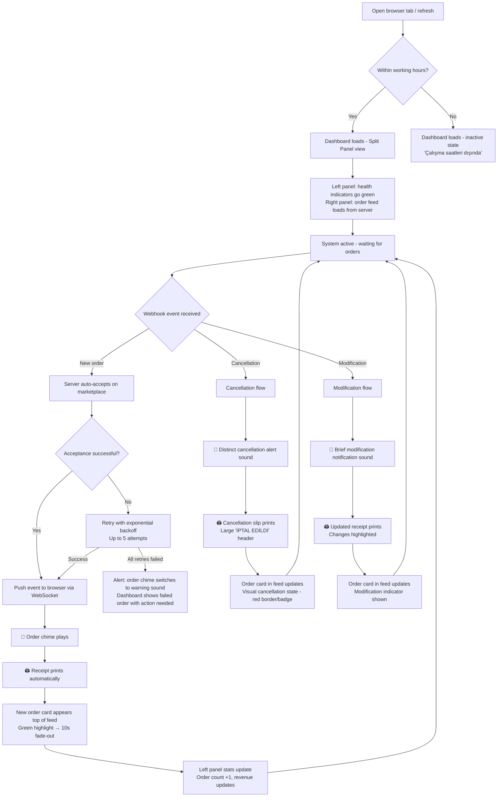
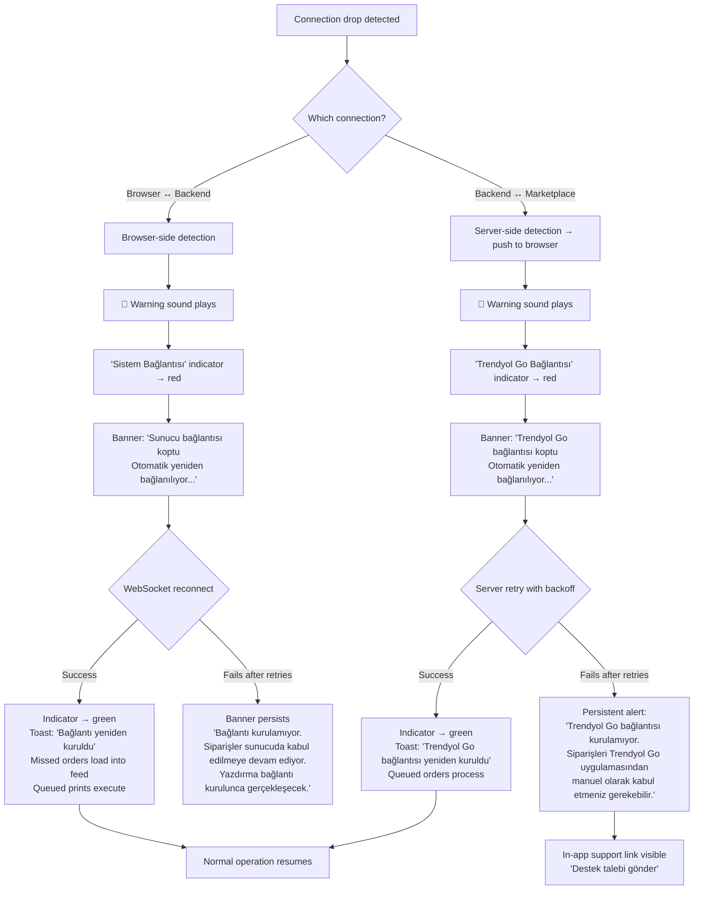
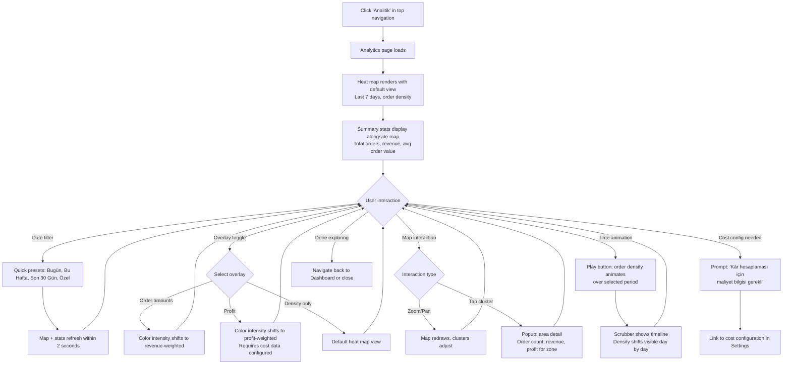
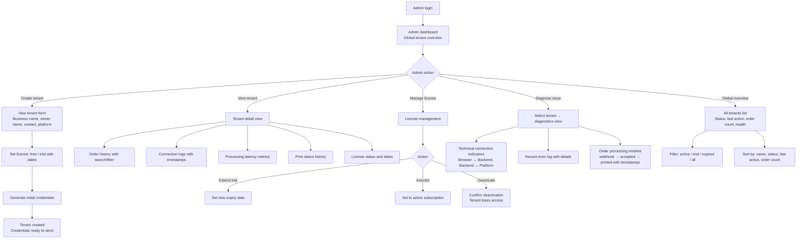
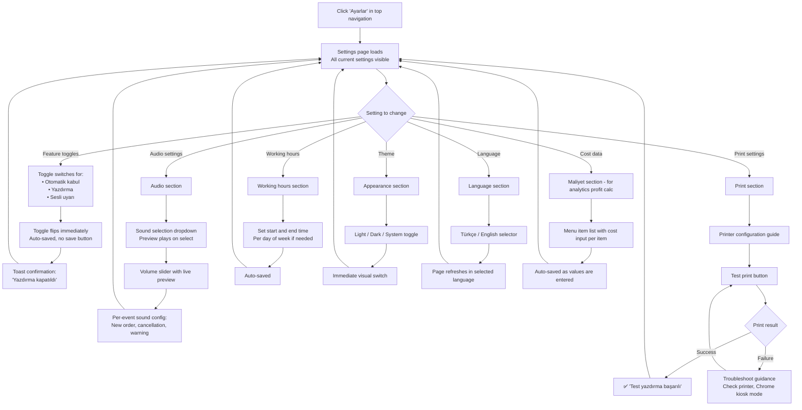

# UX Design Specification JetAdisyon

**Author:** iltan
**Date:** 2026-03-07

---

## Executive Summary

### Project Vision

JetAdisyon is a B2B SaaS order management platform for small Turkish food businesses on delivery marketplaces (Trendyol Go, Yemeksepeti). The core UX promise is **invisible reliability** — orders auto-accept, receipts auto-print, audio alerts announce what matters, and the user never touches the software during service. The product replaces existing tools at 30-40% lower cost while building a data foundation that powers analytics from day one and AI intelligence in the future.

The UX challenge is designing for a product that succeeds when nobody uses it. The interface must be radically simple during operation, instantly clear when something breaks, and genuinely insightful when the owner finally sits down to understand their business through analytics.

### Target Users

**Ahmet — Owner-Operator (Primary)**
- Runs a 1-2 person kitchen, works the grill alone during rush
- Not tech-savvy — needs zero learning curve
- Uses a laptop on the counter; browser stays open during service
- Interacts with the system during setup and analytics review, never during service
- Cost-conscious, thin margins, skeptical of new tools until proven

**Elif — Cashier/Staff (Secondary)**
- Doesn't log in or configure anything
- Passive consumer of printed receipts and audio alerts
- Needs large, readable text and loud, distinct sounds
- Escalation path: "tell the owner if something stops working"

**iltan — Admin (Internal)**
- Creates tenants, manages licenses, diagnoses issues remotely
- Needs functional admin panel with per-tenant health visibility
- Prioritizes utility over polish in admin views

### Key Design Challenges

1. **Invisible UX during service** — The product's success state is zero interaction. The UI must balance being completely ignorable when healthy with being immediately attention-grabbing when something breaks. This is fundamentally an alert system design problem.

2. **Low tech literacy, zero friction tolerance** — Onboarding must feel obvious. Settings must be discoverable but minimal. Error states must use plain language and clear actions. No technical jargon.

3. **Browser-based MVP constraints** — Audio and printing require the browser tab to stay open. The UX must reinforce this requirement naturally without it feeling like a limitation.

4. **Multi-role, single-screen environment** — Staff need a stripped-down view that prevents accidental configuration changes while preserving the emergency toggle. The permission boundary must feel intuitive, not restrictive.

5. **Analytics for non-data users** — Heat maps and overlays must tell a visual story ("your orders come from here, you make money here") rather than presenting raw data. First-time analytics experience must be self-explanatory.

### Design Opportunities

1. **Audio-first interaction model** — Distinct sounds for orders, cancellations, modifications, and warnings create a complete UX layer that works without looking at a screen. This is the signature interaction for a kitchen environment.

2. **Glanceable dashboard** — One look tells you everything: green = healthy, orders flowing. Red = problem. Large status indicators, minimal clutter. Radically simple compared to typical SaaS dashboards.

3. **Analytics as the "aha" moment** — The first time Ahmet sees where his orders come from on a heat map, JetAdisyon stops being a "cheaper alternative" and becomes something genuinely new. This is the design moment to nail — it's where product differentiation becomes tangible.

## Core User Experience

### Defining Experience

JetAdisyon operates across three distinct experience modes, each with fundamentally different UX requirements:

**Service Mode (Daily, during working hours)**
The primary experience — and paradoxically, the one with the least interaction. During service, the system runs autonomously: webhooks arrive, orders auto-accept, receipts print, audio chimes announce. The dashboard displays a live order feed with new orders appearing in real-time, plus a persistent connection health indicator. Ahmet glances at the screen occasionally — he sees orders flowing, green status, everything healthy. He never clicks anything.

**Configuration Mode (Setup + occasional adjustments)**
The onboarding and settings experience. Happens once during initial setup (connect marketplace → configure print/audio → test order), then sporadically when something changes (printer breaks, volume adjustment, working hours update). Must be fast, obvious, and completable without documentation.

**Insight Mode (Weekly/monthly, during quiet hours)**
The analytics experience — a separate section entirely from the service dashboard. Ahmet opens this on a quiet Sunday morning to explore where his orders come from, which areas are profitable, and how patterns shift over time. This is exploratory and engaging — the opposite of the "don't touch it" service mode.

The core design challenge: these three modes serve the same user but demand completely different UX approaches — passive monitoring, quick configuration, and exploratory analysis.

### Platform Strategy

**Desktop-primary, browser-based**
- Primary environment: Chrome/Chromium on a laptop or desktop, sitting on a kitchen counter or cashier station
- Desktop-primary design with basic mobile graceful degradation — layouts don't break on mobile but are not optimized for small screens
- Browser tab stays open for hours during service; design must accommodate long-running sessions
- Optional full-screen toggle button available for a cleaner kiosk-like view, but not a core feature — normal maximized window is sufficient
- No offline capability in MVP — browser must maintain connection for real-time order flow

**Browser-based constraints (MVP)**
- Audio alerts require browser tab to be open and active
- Receipt printing must be fully automatic with zero interaction during service — no print dialogs. MVP approach: Chrome kiosk printing mode (`--kiosk-printing` flag) auto-prints to the default printer without dialog. One-time setup during onboarding: configure Chrome launch shortcut with the flag + set default printer in OS settings. Future upgrade path: lightweight local print agent for more robust silent printing.
- Real-time updates via WebSocket/SSE — browser is the notification and display layer, not the processing layer
- All order processing happens server-side — if the browser closes, orders are still accepted; they queue for print/alert when the tab reopens

### Effortless Interactions

**Zero-effort order flow (Service Mode)**
- Order arrives → chime plays → receipt prints. No clicks, no confirmations, no interactions required.
- Distinct audio signatures: new order chime, cancellation alert (sharper), modification notification (brief), connection warning (different tone entirely). The ear learns the system before the eye does.
- Cancellation and modification slips print automatically with clear visual differentiation from standard orders.

**Obvious onboarding (Configuration Mode)**
- Three-step flow: connect marketplace → configure print/audio → test order
- Target: first auto-printed order in under 15 minutes
- Print and audio setup strongly recommended (not skippable by default) — without them, the core value proposition doesn't land
- Printer setup includes Chrome kiosk printing configuration guidance — one-time, guided, then fully automatic
- Test order available at any time, not just during onboarding

**Self-explanatory analytics (Insight Mode)**
- Heat map loads with sensible defaults — no configuration needed to see the first view
- Visual storytelling: "your orders come from here" is immediately obvious from color density
- Overlay toggles (order amounts, profit) are discoverable but don't clutter the initial view
- Date filtering with quick presets (this week, last 30 days) before custom ranges

**Independent feature toggles**
- Auto-accept, print, and audio are fully decoupled — any combination works
- Printer breaks? Toggle print off, keep auto-accept and audio running. Zero disruption.
- Settings persist across sessions — configure once, forget

### Critical Success Moments

**Moment 1: The first test order (Onboarding)**
The chime plays, the receipt prints. Ahmet grins. This is the "it works" moment — if this feels good, trust is established. If it fails or feels clunky, the product is dead on arrival. Target: 8 minutes from login to this moment.

**Moment 2: The first unattended rush (Service Mode)**
Friday night, 47 orders, zero manual accepts. Ahmet closes up and glances at the dashboard — all orders accounted for, connection healthy all evening. This is the "it's reliable" moment — the product proves it can replace his current tool.

**Moment 3: The first heat map (Insight Mode)**
Sunday morning, Ahmet opens analytics and sees where his orders come from for the first time. He discovers a cluster in a neighborhood he didn't expect. This is the "this is more than a simple order tool" moment — the product becomes something new.

**Moment 4: The first failure recovery (Edge Case)**
Connection drops during service. Red indicator appears, warning sound plays. System reconnects automatically, queued orders process. Ahmet never had to intervene. This is the "I can trust this" moment — failure handling done right builds more trust than never failing at all.

**Break-or-make flows:**
- Webhook → accept → print must complete in <2 seconds. Perceptible delay erodes trust.
- Connection loss must be immediately visible and audible. Silent failure is the worst UX outcome.
- Onboarding that takes more than 15 minutes or requires external help has failed.

### Experience Principles

1. **Silence is success.** The best session is one where the user never interacts with the product. Design for the absence of interaction during service — if Ahmet is clicking things during a rush, something went wrong.

2. **Sound before screen.** Audio is the primary communication channel during service. Every system state that matters has a distinct sound. The ear learns the product before the eye does.

3. **One glance, full picture.** Any screen the user looks at should communicate its essential state in under 2 seconds. Green = healthy. Red = problem. Numbers are big. Status is obvious. No parsing required.

4. **Fail loudly, recover quietly.** When something breaks, announce it immediately and clearly (audio + visual). When it recovers, do it automatically and silently. The user should know about problems but never have to fix them.

5. **Earn trust in layers.** First: "it works" (test order). Then: "it's reliable" (first rush). Then: "it's more" (analytics insight). Each layer builds on the previous one. Don't front-load complexity — let the product reveal its depth over time.

**Receipt layout hierarchy (MVP — fixed format, customizable in future):**
1. Order items + quantities — largest text, top of receipt
2. Delivery/preparation notes — prominent, immediately below items
3. Order number + timestamp — smaller, bottom section
4. Cancellation/modification receipts: same layout with clear "CANCELLED" or "MODIFIED" header in large text, changes highlighted

## Desired Emotional Response

### Primary Emotional Goals

**Trust** is the foundational emotion. Every interaction either builds or erodes it. Ahmet is switching from a tool that already works — he needs to feel that JetAdisyon is at least as reliable before he can feel anything else. Trust is not a feature; it's the cumulative result of every order that prints on time, every connection drop that recovers silently, every setting that persists correctly.

**Discovery** is the differentiating emotion. The analytics experience must create genuine "I didn't know this about my own business" moments. This is what turns a cost-saving switch into enthusiasm — and enthusiasm into word-of-mouth recommendations.

**Absence of anxiety** is the service-mode emotion. During a rush, Ahmet should feel nothing about the software. Not relief, not gratitude — just the quiet confidence that orders are flowing. The best emotional state during service is not feeling anything about JetAdisyon at all.

### Emotional Journey Mapping

| Stage | Desired Emotion | Anti-Emotion (Avoid) |
|-------|----------------|---------------------|
| **First discovery** (hearing about JetAdisyon) | Curiosity + low-risk interest ("it's cheaper, why not try?") | Skepticism, feeling sold to |
| **Onboarding** | Relief + pleasant surprise ("that was easier than I expected") | Confusion, frustration, feeling lost |
| **First test order** | Confidence + small delight ("it works, just like that") | Doubt, technical anxiety |
| **First real service** | Cautious trust ("let's see if it holds up") | Nervousness about missing orders |
| **First full rush** | Absence of anxiety → growing trust ("it just works") | Hyper-awareness of the software |
| **Failure/recovery** | Informed calm ("I know what's happening, the system is handling it") | Panic, helplessness, "am I losing orders?" |
| **First analytics session** | Curiosity → discovery → empowerment ("I can see my business in a new way") | Overwhelm, confusion, "what am I looking at?" |
| **Returning daily** | Invisible familiarity — the system is part of the kitchen rhythm | Annoyance, "why do I have to deal with this?" |
| **Recommending to others** | Pride + helpfulness ("I found something good, let me share it") | Embarrassment if the product fails them |

### Micro-Emotions

**Trust vs. Skepticism** — The most critical axis. Ahmet starts skeptical (switching from a known tool). Every successful order shifts the needle. One silent failure (order lost without alert) could reset trust to zero. Trust is earned in drops and lost in buckets.

**Confidence vs. Confusion** — During onboarding and configuration. Every screen should make the next action obvious. If Ahmet has to think "what do I do now?", the design has failed.

**Calm vs. Panic** — During failure states. The difference is information: "Connection lost — retrying automatically. Orders queued." vs. a red screen with no explanation. Calm comes from understanding what's happening and knowing the system is handling it.

**Empowerment vs. Overwhelm** — In analytics. The heat map should feel like a window into his business, not a data dashboard he doesn't know how to read. Progressive disclosure: simple view first, detail on interaction.

**Invisible familiarity vs. Annoyance** — The daily return. The system should feel like a reliable kitchen appliance — you don't think about your fridge working, you just open it. If the software demands attention when nothing is wrong, it's failing emotionally.

### Design Implications

| Emotional Goal | UX Design Approach |
|---------------|-------------------|
| **Build trust incrementally** | Show processing confirmations subtly (green checkmarks in order feed), display uptime/health persistently, never hide system state |
| **Relief during onboarding** | Minimal steps, clear progress indicator, celebrate the test order moment (visual + audio confirmation that it worked) |
| **Absence of anxiety in service** | No unnecessary UI updates, no attention-grabbing animations for normal events. The chime and printer do the communicating — the screen stays calm |
| **Informed calm during failure** | Plain-language error states ("Connection lost — retrying automatically"), clear distinction between "JetAdisyon issue" vs. "marketplace issue", explicit fallback instructions |
| **Discovery in analytics** | Heat map as the hero element — visual and immediate. No tables or charts first. Let the map tell the story, then offer detail on interaction |
| **Prevent recommendation embarrassment** | Reliability is non-negotiable. If Ahmet recommends JetAdisyon and it fails for his neighbor, that's an emotional and social cost. The product must earn the recommendation. |

### Emotional Design Principles

1. **Trust is the product.** Reliability isn't a technical requirement — it's an emotional one. Every architectural decision, every retry mechanism, every health indicator exists to build and maintain the user's trust. If trust breaks, nothing else matters.

2. **Calm is the default state.** The UI should feel like a calm, steady heartbeat during service. Normal operation = visual stillness. Only deviations from normal (new orders, errors, connection changes) create movement or sound. The screen is quiet when everything is fine.

3. **Inform, never alarm.** Error states communicate clearly but never panic the user. The tone is "here's what happened, here's what's being done, here's what you can do if needed." No red screens, no exclamation marks, no ambiguity. Urgency through clarity, not through visual noise.

4. **Celebrate milestones silently.** The test order working, the first full rush, the 100th order — the product can acknowledge these subtly (a small counter, a quiet visual cue) without interrupting the "invisible" promise. The user notices if they look; they're not forced to engage.

5. **Make discovery feel personal.** Analytics should feel like the product knows Ahmet's business and is showing him something about it — not like a generic dashboard with his data plugged in. The heat map of his neighborhood, his order patterns, his profit zones. It's his data telling his story.

## UX Pattern Analysis & Inspiration

### Inspiring Products Analysis

**Square POS / Toast POS — Kitchen-environment interface design**
Restaurant POS systems operate in the same physical environment as JetAdisyon: a counter, a busy kitchen, greasy hands, split attention. Their UX success comes from ruthlessly low information density — large text, high contrast, minimal elements, glanceable status. They've proven that restaurant software must communicate through size and position, not through detail and density. JetAdisyon's service mode dashboard should feel closer to a POS status screen than a traditional SaaS dashboard.

**UptimeRobot / Betterstack — Health monitoring as primary UX**
Uptime monitoring tools share JetAdisyon's core UX challenge: the success state is "nothing is wrong." These products communicate system health through persistent visual indicators (green/red dots, status bars) that require zero cognitive effort to parse. Their escalation model — subtle green → amber warning → red alert — maps directly to JetAdisyon's connection health needs. The key pattern: **status through color and position, not through text**.

**Uber Eats / DoorDash merchant experience — Sound-first order management**
Delivery platform merchant tablets proved that audio is the primary interface in a kitchen. The chime announces orders; the screen is a secondary confirmation. Auto-accept flows, live order queues, and distinct alert sounds for different event types (new order, cancellation) are established patterns in this space. Uber's interface is known for being clean and intuitive — a benchmark for how order management can feel effortless. JetAdisyon should match this audio-first model while offering a cleaner, simpler visual layer.

**Mapbox / Google Maps heat map visualizations — Explorable data storytelling**
Both Mapbox and Google Maps demonstrate how geographic data visualization should feel: intuitive zoom/pan, color density that tells a story without labels, and progressive detail on interaction. The heat map should feel like exploring a map, not reading a chart. Tap a cluster → get a story (order count, revenue, profit for that zone). No data tables needed upfront. These tools prove that map-based analytics can be self-explanatory when the visual language is strong.

### Transferable UX Patterns

**Navigation Patterns:**
- **Persistent health bar** (from monitoring tools) — Connection status always visible in a fixed position, communicating through color. Never hidden behind a menu or settings page.
- **Mode-based navigation** (derived from POS systems) — Clear separation between service view (live order feed), settings, and analytics. Each mode has its own visual character. No hybrid screens trying to do everything.

**Interaction Patterns:**
- **Audio-first notification** (from merchant tablets) — Distinct sounds for each event type. The ear processes the event; the screen provides detail only if the user looks. Sound is the trigger, screen is the context.
- **Live order feed** (from merchant tablets) — New orders animate in at the top, older orders scroll down. Each order shows status (accepted, printed) with minimal detail. Tapping/hovering reveals more.
- **Map exploration** (from Mapbox/Google Maps) — Zoom, pan, tap for detail. No instructions needed. The interaction model is already learned by every user who has used Google Maps.

**Visual Patterns:**
- **Status through color** (from monitoring dashboards) — Green = healthy, amber = warning, red = critical. Applied to connection status, order processing status, and system health. Universal, no learning curve.
- **Large-type, high-contrast layouts** (from POS systems) — During service mode, text is oversized. Numbers are prominent. Whitespace is generous. The screen is readable from 2 meters away while standing at a grill.
- **Progressive disclosure in analytics** (from map tools) — Heat map is the first thing shown. Summary stats (order count, revenue, avg value) sit alongside. Overlays and filters are accessible but not front-loaded. Detail emerges on interaction.

### Anti-Patterns to Avoid

- **Dense data tables as primary view** — Restaurant owners don't read spreadsheets. Order history should be a scannable feed, not a sortable table. Tables can exist as a secondary view for admin diagnostics, never as the tenant's primary interface.
- **Notification overload** — Every order shouldn't flash, bounce, or demand attention on screen. The chime and printer handle notification. The screen stays calm. Only exceptions (errors, cancellations) get visual emphasis.
- **Complex navigation with many menu levels** — Ahmet has three things to do: watch orders, change settings, view analytics. Three top-level sections, no submenus, no dropdowns within dropdowns. If it takes more than one click to reach any primary function, the navigation is too complex.
- **Settings pages that feel like control panels** — Feature toggles should feel like light switches, not configuration forms. On/off, volume slider, done. No "advanced settings," no nested options, no save buttons (auto-save everything).
- **Overly complex onboarding** — Multi-page tutorials, feature tours, tooltips everywhere. JetAdisyon's onboarding is three steps with one test. If the user needs a guide to use the guide, the UX has failed.
- **Generic dashboard aesthetic** — Avoid the "every SaaS looks the same" trap: sidebar navigation, card-heavy layouts, blue accent color. JetAdisyon should feel like a purpose-built tool for a kitchen, not a generic admin panel with restaurant data.

### Design Inspiration Strategy

**What to Adopt:**
- Audio-first notification model from merchant tablet UX — proven in this exact environment
- Persistent health indicator from monitoring dashboards — the always-visible green/red status pattern
- Map-as-hero analytics from Mapbox/Google Maps — explorable, self-explanatory, no data literacy required
- Large-type, high-contrast visual language from POS systems — readable at distance, scannable in seconds

**What to Adapt:**
- POS order queue → live order feed for a monitoring context (Ahmet watches, doesn't interact)
- Monitoring dashboard escalation model → simplified to three states (healthy, warning, critical) with audio pairing
- Map interaction patterns → simplified for a single-purpose analytics view (no layers menu, no search, just the heat map with overlay toggles)

**What to Avoid:**
- Notion-style complexity — powerful but hard to use. JetAdisyon's users have zero tolerance for learning curves
- Dense data table layouts — conflicts with "one glance, full picture" principle
- Notification-heavy interfaces — conflicts with "silence is success" and "calm is the default state"
- Generic SaaS chrome — sidebar + cards + blue accent. JetAdisyon needs its own visual identity that reflects its kitchen-counter environment

## Design System Foundation

### Design System Choice

**shadcn/ui v4 + Tailwind v4** — already installed and configured in the monorepo (`packages/ui` for shared components, `apps/web` for the frontend). shadcn/ui provides unstyled, composable, accessible components that are copied into the project — full ownership, full customization control.

This is a **themeable system** approach: proven component patterns and accessibility out of the box, with complete freedom to customize visual identity and build domain-specific components on top.

### Rationale for Selection

- **Already in the stack** — No migration cost, no new dependencies. The team (solo developer) already knows the tooling.
- **Component ownership** — shadcn/ui components live in the codebase, not in node_modules. They can be modified directly to serve JetAdisyon's specific needs without fighting upstream abstractions.
- **Accessibility built-in** — Radix UI primitives under the hood handle keyboard navigation, focus management, ARIA attributes. Critical for a product that needs to "just work" without accessibility being an afterthought.
- **Tailwind v4 integration** — Utility-first CSS with design tokens. Theme customization happens at the token level, propagating consistently across all components.
- **Composable primitives** — Complex custom components (live order feed, health status bar, audio controls) can be built by composing shadcn primitives rather than starting from scratch.

### Implementation Approach

**Use shadcn/ui components whenever possible.** Every standard UI element (buttons, toggles, dialogs, cards, inputs, dropdowns, tabs, toasts) uses stock shadcn components with theme customization. Custom components are only built when shadcn doesn't have an equivalent.

**Custom components needed (built on shadcn primitives):**

| Component | Purpose | Built With |
|-----------|---------|-----------|
| Live order feed | Real-time scrolling order list during service mode | Card, Badge, ScrollArea + custom WebSocket integration |
| Health status bar | Persistent connection status indicator (green/amber/red) | Badge, custom status logic |
| Audio control panel | Sound selection, volume slider, per-event toggles | Select, Slider, Switch |
| Heat map view | Analytics map with order density visualization | External map library + custom overlays |
| Order receipt preview | Print-formatted order display | Custom layout, browser print API |
| Emergency toggle | Staff "System On/Off" with confirmation | Button, AlertDialog |
| Onboarding stepper | Three-step guided setup flow | Custom stepper using shadcn primitives |

**Theme & mode:**
- Support both dark and light mode
- Default to system preference
- User-configurable per tenant in settings
- Theme tokens defined at the Tailwind level for consistent propagation

### Customization Strategy

**Visual identity:** No prescribed brand direction — visual identity will emerge during the visual design phase. The design system provides the structural foundation; color palette, typography scale, and accent choices will be defined when designing specific screens. The key constraint is that the visual language must support the UX principles established earlier: large type, high contrast, glanceable status, calm default state.

**Component customization layers:**
1. **Theme tokens** (Tailwind CSS variables) — Colors, spacing, radius, typography. Applied globally, affects all shadcn components automatically.
2. **Component variants** — shadcn components extended with JetAdisyon-specific variants (e.g., order card with status-colored border, oversized toggle for kitchen use).
3. **Custom components** — Domain-specific components composed from shadcn primitives. Follow the same token system and styling conventions for visual consistency.

**Design token priorities for JetAdisyon:**
- **Typography scale biased large** — Body text larger than typical SaaS defaults. Service mode elements even larger. Readable from distance.
- **Color semantics** — Green/amber/red for system status must be consistent everywhere and must meet WCAG contrast requirements in both light and dark modes.
- **Spacing generous** — Touch targets and clickable areas larger than default. Even though desktop-primary, kitchen hands are not precise.
- **Border radius and shadows minimal** — Clean, professional, not playful. The tool should feel reliable, not cute.

## Defining Core Interaction

### Defining Experience

**The one-liner:** "Orders come in, the chime plays, the receipt prints. I don't touch anything."

JetAdisyon's defining experience is the absence of interaction. The product succeeds when the user forgets it exists during service. This is rare in software — most products are defined by what users do with them. JetAdisyon is defined by what users don't have to do.

**The differentiator:** "I can see where my orders come from on a map."

The analytics heat map is the secondary defining experience — the moment JetAdisyon stops being a cost-saving substitute and becomes something new. Together, these form the complete pitch: "I don't touch anything during service, and I can see my whole business on a map."

**How Ahmet describes it to his neighbor:**
"It does everything his current tool does — orders come in, chime plays, receipt prints, I don't touch anything. But it also gives me great suggestions, I can see anything I want about my business. And it's cheaper."

### User Mental Model

**Current workflow (without JetAdisyon):**
1. Marketplace app open on tablet/phone
2. Notification sound from marketplace app
3. Manually accept order in marketplace merchant panel
4. Order appears in merchant panel / order management tool
5. Print receipt or read from screen
6. Prepare food

**JetAdisyon workflow:**
1. Browser tab open with JetAdisyon dashboard (set and forget)
2. Order arrives via webhook → auto-accepted server-side → chime plays → receipt prints
3. Ahmet hears chime, glances at receipt, prepares food
4. Steps 2-3 repeat. No manual intervention. Ever.

**Mental model shift:** From "I manage orders with a tool" to "orders manage themselves." The key insight is that Ahmet's mental model doesn't need to include software at all — the chime and the printer are the interface. The browser dashboard is just a health monitor he glances at occasionally.

**Existing expectations from existing tool users:**
- Auto-accept works 100% of the time (baseline, not a feature)
- Receipts print without touching the screen
- If something breaks, they know immediately
- JetAdisyon must match this baseline before adding anything new

### Success Criteria

| Criteria | Metric | Why It Matters |
|----------|--------|---------------|
| Orders flow without interaction | Zero clicks during service hours | The defining promise — if Ahmet touches the laptop during a rush, we've failed |
| Immediate audio feedback | Chime within 500ms of order receipt | The ear confirms the order before the eye does |
| Receipt prints automatically | Print triggered within 2s, no dialog | The physical receipt is the handoff to food preparation |
| System health always visible | One glance = full status picture | Trust requires transparency — Ahmet needs to know it's working |
| Failure is loud and clear | Warning sound + visual within 1s of connection loss | Silent failure destroys trust instantly |
| Analytics tells a story | Heat map self-explanatory on first view | The differentiator must land without explanation |
| Onboarding is fast | Login to first test print in <15 minutes | First impression determines adoption |

### Novel UX Patterns

**Mostly established patterns, combined in a novel way.**

JetAdisyon doesn't require users to learn new interaction models. Every component uses familiar patterns:
- Audio alerts → established in merchant tablet apps
- Live feed → established in messaging and notification apps
- Health indicators → established in monitoring dashboards
- Heat maps → established in Google Maps / navigation apps
- Toggle switches → universal

**The novelty is the combination and the "non-interaction" as core UX:**
- No product in this market combines auto-accept + auto-print + audio + health monitoring + analytics in a single browser tab
- The "success is silence" pattern — where the product's best state is invisibility — is uncommon in SaaS and requires deliberate design restraint

**No user education needed.** Every individual element is familiar. The only "teaching" moment is onboarding: connect marketplace → set up printer → test. After that, the product teaches itself through use.

### Experience Mechanics

**1. Service Mode — The Automated Order Flow**

*Initiation:* Ahmet opens the browser tab in the morning. Dashboard loads, connection status shows green. System is active within configured working hours. No "start" button — it's always on.

*Interaction (per order):*
- Webhook arrives → server auto-accepts → pushes event to browser
- Audio chime plays (distinct per event type: new order, cancellation, modification)
- Receipt prints automatically (Chrome kiosk mode, no dialog)
- New order card appears at the top of the live feed with a green highlight
- Green highlight fades out over ~10 seconds to regular background color
- Existing orders push down in the feed, new order takes top position
- Order card shows: items, quantities, status (accepted/printed), timestamp

*Feedback:*
- **Audio:** The chime IS the primary feedback. Ahmet hears it, knows an order arrived.
- **Visual (live feed):** Green-highlighted card fades in at the top — visible if he glances, ignorable if he doesn't.
- **Visual (health bar):** Persistent connection indicators remain green. Multiple granular indicators: browser ↔ backend connection, backend ↔ platform connection (per marketplace). If any link breaks, the specific indicator turns amber/red.
- **Print:** Physical receipt is the tangible confirmation. Tear it off, pin it to the rail.

*Completion:* There is no "completion" in service mode — it's a continuous loop that ends when working hours end or Ahmet closes the tab. The dashboard passively accumulates the day's orders in the feed.

**2. Failure Mode — Connection Drop**

*Initiation:* Connection between backend and marketplace drops. Server detects within seconds.

*Interaction:*
- Specific connection indicator turns red (e.g., "Backend ↔ Trendyol Go" goes red while "Browser ↔ Backend" stays green)
- Warning sound plays (distinct from order chime — sharper, more urgent)
- Dashboard shows plain-language message: "Trendyol Go connection lost — retrying automatically"
- System retries with exponential backoff (up to 5 attempts)

*Feedback:*
- If reconnection succeeds: indicator returns to green, queued orders process, brief "reconnected" toast notification
- If reconnection fails after retries: persistent alert with fallback instructions ("Orders may need manual acceptance on Trendyol Go")

*Completion:* Either automatic recovery (silent, green indicator returns) or escalation to user with clear next steps.

**3. Onboarding — First Setup**

*Initiation:* Ahmet receives credentials from admin, logs in for the first time. Onboarding flow starts automatically.

*Interaction:*
- Step 1: Connect marketplace account (enter credentials or OAuth)
- Step 2: Configure print and audio (set default printer via Chrome kiosk setup guide, choose alert sound, adjust volume)
- Step 3: Trigger test order

*Feedback:*
- Each step shows clear completion state (checkmark, green indicator)
- Test order: chime plays + receipt prints = visual + audio + physical confirmation
- Success moment: "You're all set! Orders will flow automatically during your working hours."

*Completion:* Onboarding complete → redirected to main dashboard. System is ready for first real service.

**4. Analytics — Insight Exploration**

*Initiation:* Ahmet navigates to the analytics section (separate from service dashboard). Heat map loads with sensible defaults (last 7 days).

*Interaction:*
- Heat map shows order density by location — color clusters on a map of his area
- Quick filter presets: today, this week, last 30 days, custom range
- Overlay toggles: order amounts, profit per area
- Tap a cluster → popup with area detail (order count, revenue, profit)
- Zoom/pan to explore — standard map interaction

*Feedback:*
- Map responds within 200ms to interactions
- Filter changes refresh data within 2 seconds
- Summary stats (total orders, total revenue, avg order value) update alongside the map

*Completion:* No explicit completion — Ahmet explores until satisfied, then navigates back to the service dashboard or closes the tab.

## Visual Design Foundation

### Color System

**Palette Strategy: Neutral base + warm accent, with strict semantic color separation**

**Base Colors (Neutral):**
- Slate gray scale for backgrounds, surfaces, borders, and text
- Light mode: white/slate-50 backgrounds, slate-900 text
- Dark mode: slate-900/slate-950 backgrounds, slate-50 text
- Consistent neutral foundation across both modes

**Primary Accent (Warm):**
- Amber/orange range as the brand accent color — used for primary actions, active states, navigation highlights, and brand identity elements
- Warm tone feels grounded and approachable — fits the neighborhood restaurant tool personality
- Deliberately avoids green, amber-warning, and red to prevent collision with semantic status colors

**Semantic Status Colors (Reserved, never used for branding):**
- **Green** — Healthy, connected, successful. Used exclusively for: connection status indicators, order accepted confirmations, onboarding step completion.
- **Amber/Yellow** — Warning, degraded. Used exclusively for: connection degradation, retry in progress, license expiry warnings.
- **Red** — Critical, disconnected, failed. Used exclusively for: connection lost, order acceptance failed, system errors.
- These three colors must maintain WCAG AA contrast ratios in both light and dark modes. They are functional, not decorative — never used for buttons, links, or brand elements.

**Additional Semantic Colors:**
- **Blue** (informational) — Tooltips, help text, neutral notifications
- **Muted variants** — Lower-opacity versions of all semantic colors for backgrounds and subtle indicators

**Color Usage Rules:**
1. Status colors are sacred — green/amber/red only ever mean system state
2. Primary accent (warm) is the only "brand" color in the UI
3. Neutral scale does the heavy lifting — most of the interface is gray + white/dark
4. The live order feed green highlight (new order fade-out) uses the semantic green, reinforcing "this is a good thing"

### Typography System

**Primary Typeface: Inter**
- Already the shadcn/ui default — zero configuration overhead
- Excellent Turkish character support (İ, ı, Ö, ö, Ü, ü, Ç, ç, Ş, ş, Ğ, ğ)
- Highly legible at all sizes, including the oversized text needed for service mode
- Clean, professional, neutral personality — lets the content speak

**Type Scale (biased large for kitchen readability):**

| Token | Size | Weight | Use Case |
|-------|------|--------|----------|
| display | 36px / 2.25rem | 700 | Service mode: order count, key metrics |
| h1 | 30px / 1.875rem | 700 | Page titles, analytics summary numbers |
| h2 | 24px / 1.5rem | 600 | Section headers, card titles |
| h3 | 20px / 1.25rem | 600 | Sub-headers, order card item names |
| body-lg | 18px / 1.125rem | 400 | Service mode body text, order details |
| body | 16px / 1rem | 400 | Default body text, settings, admin |
| body-sm | 14px / 0.875rem | 400 | Secondary information, timestamps, metadata |
| caption | 12px / 0.75rem | 400 | Labels, footnotes (used sparingly) |

**Typography Rules:**
1. Service mode uses body-lg as minimum text size — readable from distance
2. Display size reserved for key numbers (order count, revenue) visible at a glance
3. No text smaller than caption (12px) anywhere in the application
4. Font weight used for hierarchy: 700 for primary, 600 for secondary, 400 for body
5. Line height: 1.5 for body text, 1.2 for headings — generous for readability

**Receipt Typography (print):**
- Monospace or high-legibility sans-serif for printed receipts
- Item names: bold, large (comparable to h2 on screen)
- Quantities: bold, same size as items
- Notes: regular weight, slightly smaller
- Order number/time: smallest text on receipt, bottom section

### Spacing & Layout Foundation

**Base Grid: 8px**
- All spacing values are multiples of 8px: 8, 16, 24, 32, 40, 48, 64, 80, 96
- 4px used only for tight internal spacing (e.g., icon-to-label gap, badge padding)
- Generous by default — more whitespace than typical SaaS

**Spacing Scale:**

| Token | Value | Use Case |
|-------|-------|----------|
| xs | 4px | Icon gaps, badge padding, tight internal spacing |
| sm | 8px | Inline element spacing, compact list items |
| md | 16px | Default component padding, card internal spacing |
| lg | 24px | Section spacing, card gaps |
| xl | 32px | Major section separation |
| 2xl | 48px | Page-level section breaks |
| 3xl | 64px | Hero spacing, major layout gaps |

**Layout Structure:**

- **Service mode dashboard:** Single-column or two-column layout. Live order feed takes the majority of space. Health indicators fixed at top. No sidebar — maximum screen real estate for the order feed.
- **Settings/Configuration:** Standard content area with generous padding. Form elements spaced for easy interaction. Auto-save eliminates the need for action bars.
- **Analytics:** Map takes the hero position (60-70% of viewport). Summary stats and filters in a secondary panel alongside or above the map.
- **Admin panel:** More conventional SaaS layout acceptable here — sidebar navigation is fine for admin since iltan is tech-savvy and managing multiple tenants.

**Layout Rules:**
1. Service mode: no sidebar, maximum content area. Navigation minimal and tucked away.
2. Tenant views (settings, analytics): top navigation with 3 clear sections (Dashboard, Analytics, Settings). No sidebar.
3. Admin views: sidebar navigation is acceptable — admin has more sections and iltan is comfortable with standard SaaS patterns.
4. Touch targets: minimum 44x44px for all interactive elements, even on desktop. Kitchen hands are not precise.
5. Content max-width: 1280px for readability on wide screens. Service mode order feed can go wider.

### Accessibility Considerations

**WCAG AA compliance as minimum standard:**
- All text meets 4.5:1 contrast ratio against its background (both light and dark mode)
- Large text (18px+) meets 3:1 contrast ratio minimum
- Status colors (green/amber/red) tested for color blindness accessibility — status is never communicated through color alone (always paired with icon, label, or position)
- Focus indicators visible and clear on all interactive elements (Radix UI/shadcn handles this via primitives)

**Kitchen environment considerations:**
- Text sizes biased large — assumes reading distance of 1-2 meters during service
- High contrast mode support — kitchen lighting varies from bright fluorescent to dim
- Audio is the primary channel — visual accessibility is important but audio does the heavy lifting during service
- No reliance on hover states for critical information — mouse may not be in use during service

**Dark/Light mode accessibility:**
- Both modes must independently meet WCAG AA contrast requirements
- Status colors adjusted per mode to maintain contrast — not the same hex values in both modes
- Default to system preference, user-configurable per tenant
- Mode switch must not cause layout shifts or content reflow

## Design Direction Decision

### Design Directions Explored

Six design directions were generated and presented as an interactive HTML showcase (`_bmad-output/planning-artifacts/ux-design-directions.html`):

1. **Monitoring Station** — Dark, data-rich, monitoring-dashboard inspired with prominent health indicators
2. **Warm & Open** — Light mode, warm amber accents, card-based, generous whitespace
3. **Kitchen Counter** — Dark, oversized text, POS-inspired single-column with giant hero number
4. **Split Panel** — Two-column: health+stats left, live order feed right
5. **Compact Header** — Ultra-thin status bar, maximum content area for order feed
6. **Ambient Dashboard** — Minimal, giant number hero, almost screensaver-like

### Chosen Direction

**Primary: Direction 4 (Split Panel)** with health indicator style from Direction 1.

**Layout:** Two-column split — left panel for system health and today's summary stats, right panel for the live order feed. This gives Ahmet a "control" side and a "flow" side. One glance left = system status. One glance right = what's happening now.

**Health indicators:** Granular connection indicators from Direction 1, styled with user-friendly Turkish labels for tenant views:
- "Sistem Bağlantısı" (Browser ↔ Backend connection)
- "Trendyol Go Bağlantısı" (Backend ↔ marketplace connection)
- Additional per-platform indicators as marketplaces are added
- Technical labels (Browser ↔ Backend) used only in admin views

### Design Rationale

- **Split Panel suits the "one glance, full picture" principle** — health status is always visible on the left without competing with order flow on the right
- **Health indicators from Monitoring Station** provide the granular, color-coded connection status that builds trust — but labels must be accessible to non-technical users
- **Font size adjustments required** — price and time on order cards must be significantly larger than mockup defaults. These are the data points Ahmet scans from distance. Not everything needs to be bigger — item names stay prominent, price and time get bumped up specifically
- **Order card design must accommodate rich data** — real marketplace orders include portion sizes (porsiyon), ingredient modifications (include/exclude), promotions, and customer notes. The card layout must handle variable-length content while maintaining item name as the dominant visual element
- **Action button space reserved** — each order card should include a designated area for action buttons. Exact actions are TBD (dependent on marketplace API capabilities), but the layout must accommodate 1-3 buttons per order without restructuring. For now, this area can remain empty or show a minimal "details" action

### Implementation Approach

**Order Card Information Hierarchy:**
1. **Item names** — largest, boldest text. Primary visual element. Each item on its own line.
2. **Item details** — portion size, ingredient modifications (+ / -), promotions — displayed directly under each item name in a secondary style. Always visible, not collapsed.
3. **Price** — large, bold, right-aligned. Scannable from distance.
4. **Time** — large, visible alongside or near price. Not hidden in metadata.
5. **Order metadata** — order number, platform, location — smaller, secondary.
6. **Customer notes** — if present, highlighted distinctly (different background or border) so they're not missed.
7. **Action buttons** — bottom of card or right-aligned area. Space reserved, populated when marketplace API actions are defined.

**Example order card content structure:**
```
┌─────────────────────────────────────────────────────┐
│  1x Adana Kebap                            ₺145    │
│     Büyük porsiyon · Acısız · Ekstra soğan    19:32│
│  1x Lahmacun                                       │
│     Açık ayran promosyonu                          │
│  2x Ayran                                          │
│                                                     │
│  📝 "Kapıyı çalmayın, bebek uyuyor"               │
│                                                     │
│  #TG-4821 · Trendyol Go · Kadıköy                 │
│  ┌──────┐ ┌──────┐                                 │
│  │ Btn1 │ │ Btn2 │  (actions TBD)                  │
│  └──────┘ └──────┘                                 │
└─────────────────────────────────────────────────────┘
```

**Left Panel (Health + Stats):**
- System health section with Turkish-labeled connection indicators and color-coded dots
- Today's summary: order count (large), revenue (large), average order value, average latency
- Working hours display
- Compact — doesn't need to scroll. Stats update in real-time.

**Right Panel (Live Order Feed):**
- Scrollable feed of order cards
- New orders appear at top with green highlight → 10-second fade-out
- Cards expand naturally to fit order content (variable height)
- Oldest orders scroll off the bottom

**Responsive behavior:**
- On narrower screens, left panel collapses to a horizontal summary bar above the feed (similar to Direction 5's compact header)
- Mobile graceful degradation: single-column with health indicators at top, feed below

**Dark/Light mode:**
- Both modes follow the same layout structure
- Color tokens handle the theming — no structural differences between modes

## User Journey Flows

### Journey 1: Onboarding Flow

**Entry:** Ahmet receives credentials from admin, logs in for the first time.
**Goal:** Connected marketplace, configured print/audio, successful test order in <15 minutes.



**Key UX decisions:**
- Onboarding is linear — no skipping steps, no jumping ahead
- Print/audio skip is possible but actively discouraged (secondary button, warning message)
- Test order is the "moment of truth" — visual + audio + physical confirmation all at once
- Error messages always in plain Turkish with clear next action
- Progress indicator shows 3 steps clearly — user always knows where they are
- Chrome kiosk printing setup is guided with screenshots/instructions specific to the user's OS

### Journey 2: Service Mode Order Flow

**Entry:** Ahmet opens browser tab in the morning. Dashboard loads.
**Goal:** Zero-interaction order processing throughout the service day.



**Key UX decisions:**
- The order flow is a loop with no user interaction — everything is automatic
- Three distinct audio signatures: new order (chime), cancellation (sharp alert), modification (brief notification)
- Cancellation slips print with large "İPTAL EDİLDİ" header — unmistakable even at a glance
- Modification receipts highlight what changed — Ahmet can see the diff instantly
- Failed acceptance is the only scenario that might require attention — warning sound + visual alert
- Left panel stats update in real-time — order count, revenue always current
- Outside working hours, dashboard loads in inactive state with clear messaging

### Journey 3: Failure Recovery Flow

**Entry:** Connection between any system component drops.
**Goal:** Ahmet stays informed, system recovers automatically, no orders lost.



**Key UX decisions:**
- Different indicators for different connections — Ahmet can see exactly what's broken
- All messages in plain Turkish — no technical jargon
- Critical distinction communicated: if browser↔backend drops, orders are still being accepted server-side (just not printing). If backend↔marketplace drops, orders may need manual handling.
- Recovery is silent and automatic — indicator goes green, brief toast, done
- Persistent failure gives clear fallback instructions: go to the marketplace app directly
- Support link becomes prominent during persistent failures
- Queued prints execute automatically when browser connection restores — no orders lost

### Journey 4: Analytics Exploration Flow

**Entry:** Ahmet navigates to Analytics section (separate from service dashboard).
**Goal:** Understand order patterns, discover insights, feel empowered.



**Key UX decisions:**
- Heat map is the hero — it loads first, fills 60-70% of viewport
- Default view requires zero configuration — shows order density for last 7 days immediately
- Overlays are additive toggles, not modes — switch between density/amount/profit without losing map position
- Date filter presets in Turkish, custom range picker for advanced use
- Tap-to-detail on clusters is the primary drill-down interaction — no separate detail pages
- Profit overlay gracefully handles missing cost data — prompts user to configure, doesn't show broken/empty state
- Time animation is a discovery feature — not front-loaded, available as a play button
- All interactions respond within 200ms (map) or 2 seconds (data refresh)

### Journey 5: Admin Tenant Management Flow

**Entry:** iltan logs into admin panel.
**Goal:** Create tenants, manage licenses, diagnose issues.



**Key UX decisions:**
- Admin panel uses sidebar navigation — more sections to manage, iltan is comfortable with standard SaaS patterns
- Technical labels used in admin (Browser ↔ Backend) — admin understands the architecture
- Tenant overview is the landing page — quick scan of all tenants and their health
- Diagnostics view shows the full technical picture: connection chain, error logs, processing timeline
- License management is straightforward — no complex billing, just status changes with dates
- Tenant creation is a simple form — no multi-step wizard needed for admin

### Journey 6: Feature Configuration Flow

**Entry:** Ahmet opens Settings from top navigation.
**Goal:** Adjust feature toggles, audio/print preferences, or working hours.



**Staff view of settings:**
- Staff sees NO settings page at all
- Only the emergency "System On/Off" toggle is accessible — prominent but with confirmation dialog
- Emergency toggle pauses all features (auto-accept, print, audio) simultaneously
- Confirmation: "Tüm sistemler duraklatılacak. Emin misiniz?" (All systems will be paused. Are you sure?)

**Key UX decisions:**
- Every setting auto-saves — no save buttons anywhere. Change happens immediately.
- Toast confirmations for every change — user knows the action took effect
- Feature toggles look and feel like light switches — on/off, nothing else
- Audio settings include live preview — hear the sound before committing
- Test print always available — not just during onboarding
- Settings organized by section, not by complexity. All sections visible on one scrollable page, no tabs within settings
- Cost data entry is optional — analytics works without it (just no profit overlay)
- All labels in Turkish (with English alternative per tenant language setting)

### Journey Patterns

**Common patterns identified across all journeys:**

**Feedback Patterns:**
- **Immediate auto-save + toast** — Every settings change is saved instantly with a brief toast confirmation. No save buttons anywhere in the tenant UI.
- **Audio-first notification** — Every significant system event has a distinct sound. The visual update follows but is secondary.
- **Green highlight fade-out** — New items (orders, status changes) appear with green highlight that fades over 10 seconds. Communicates "new" without demanding attention.

**Error Handling Patterns:**
- **Plain Turkish error messages** — Every error message is in clear, non-technical Turkish with an explicit next action. Never just "Error" or a status code.
- **Graceful degradation messaging** — When something breaks, the system explains what still works. "Bağlantı koptu ama siparişler sunucuda kabul edilmeye devam ediyor" (Connection lost but orders continue being accepted on server).
- **Automatic recovery, silent return** — System fixes itself without user intervention. Recovery is a green indicator returning + brief toast. No "click to reconnect" buttons.

**Navigation Patterns:**
- **Three-section top nav for tenants** — Dashboard, Analitik, Ayarlar. Always visible, never more than one click from any primary function.
- **Sidebar nav for admin** — More sections, standard SaaS pattern. Admin is comfortable with complexity.
- **Mode-based visual identity** — Each section has a slightly different feel: Dashboard is monitoring-focused (live data, health indicators), Analytics is exploration-focused (map hero, filters), Settings is configuration-focused (form elements, toggles).

**State Communication Patterns:**
- **Color-coded status dots** — Green/amber/red with Turkish labels. Always paired with text — never color alone.
- **Persistent health bar** — Connection status visible from every page, not just the dashboard. Part of the page chrome, not the content area.
- **Progressive detail** — Summary visible at a glance, detail available on interaction (tap/click). Never front-load all information.

### Flow Optimization Principles

1. **Minimize clicks to zero during service.** The order flow loop has no user interaction. If Ahmet has to click during a rush, the flow design has failed.

2. **Every error message is an instruction.** "Bağlantı koptu" is not enough. "Bağlantı koptu — otomatik yeniden bağlanılıyor" tells the user what's happening. "Trendyol Go uygulamasından manuel kabul etmeniz gerekebilir" tells them what to do.

3. **Auto-save everything.** No form submission, no save buttons, no "unsaved changes" warnings. Every change takes effect immediately. Toast confirms it happened.

4. **Test before trust.** Onboarding ends with a test order. Print settings have a test print button. Audio has live preview. Users verify the system works before relying on it.

5. **Staff view is subtraction, not addition.** The staff experience is the owner experience with things removed (settings, configuration). Never design a separate staff interface — just hide what they can't access.

## Component Strategy

### Design System Components (shadcn/ui)

**Used directly with theme customization only:**

| Component | Usage |
|-----------|-------|
| Button | Actions, navigation, test order trigger |
| Switch | Feature toggles (auto-accept, print, audio) |
| Slider | Volume control |
| Select | Sound selection, language, filters |
| Input / Label | Forms (onboarding, settings, admin) |
| Card | Base for order cards, stat cards |
| Badge | Status labels, order state indicators |
| ScrollArea | Order feed scrolling |
| Toast | Auto-save confirmations, reconnection notifications |
| AlertDialog | Emergency toggle confirmation, destructive actions |
| Tabs | Admin panel sections |
| DropdownMenu | User menu, overflow actions |
| Tooltip | Help text, condensed information |
| Skeleton | Loading states |
| Separator | Visual dividers |

These components are used as-is from shadcn/ui with JetAdisyon's theme tokens applied. No structural modifications needed.

### Custom Components

Components below are built on top of shadcn primitives. Specifications describe intent and behavior — exact implementation details will be refined during development.

#### OrderCard

**Purpose:** Display a single order in the live feed with all relevant details.
**Content:** Item names (primary), item details (portion, modifications, promotions), price, time, order metadata, customer notes, action buttons.
**States:**
- **New** — green highlight background, fading out over ~10 seconds
- **Default** — standard card appearance
- **Cancelled** — red border/badge, "İPTAL EDİLDİ" indicator
- **Modified** — visual indicator showing the order was updated
- **Action needed** — warning state for failed acceptance

**Key design rules:**
- Item names are the largest, boldest text — the primary visual element
- Price and time are large and scannable from distance
- Customer notes visually distinct (different background/border) so they're never missed
- Action button area reserved at bottom — populated based on marketplace API capabilities
- Variable height — card expands naturally to fit content, no truncation of items or notes

#### OrderFeed

**Purpose:** Real-time scrollable list of orders during service mode.
**Behavior:**
- New orders animate in at the top, pushing existing orders down
- Green highlight on new orders fades over ~10 seconds
- Feeds from WebSocket events — updates without page refresh
- Rebuilds from server data on page load/refresh — no state lost
- Scrollable with ScrollArea, auto-scrolls to top on new order (unless user has scrolled down manually)

#### HealthStatusBar

**Purpose:** Persistent connection health display visible from every page.
**Content:** Multiple ConnectionIndicator components showing each link in the chain.
**Placement:** Fixed position — part of page chrome, not content area. Visible on Dashboard, Analytics, and Settings pages.
**Labels:** User-friendly Turkish for tenant views (e.g., "Sistem Bağlantısı", "Trendyol Go Bağlantısı"). Technical labels for admin views.

#### ConnectionIndicator

**Purpose:** Single connection status dot with label.
**States:**
- **Green** — connected, healthy
- **Amber** — degraded, retrying, warning
- **Red** — disconnected, failed
**Accessibility:** Status always communicated via color + text label + optional icon. Never color alone.

#### StatsPanel

**Purpose:** Left panel in the split layout showing today's summary numbers.
**Content:** Order count, total revenue, average order value, average processing latency. Working hours display.
**Behavior:** All values update in real-time via WebSocket. No manual refresh needed.

#### AudioControlPanel

**Purpose:** Configure audio alert preferences in Settings.
**Content:** Sound selection per event type (new order, cancellation, modification, warning), volume slider, live preview on selection.
**Behavior:** Changes auto-save. Preview plays the selected sound at the selected volume immediately.

#### HeatMapView

**Purpose:** Analytics map showing order location data with overlays.
**Content:** Heat map of order density, toggleable overlays (order amounts, profit), cluster interaction, date filtering.
**Built with:** External map library (Mapbox GL JS, Leaflet, or Google Maps — decision during implementation based on cost/capability). Custom overlay and interaction layer on top.
**Key behavior:** Loads with sensible defaults (last 7 days, density view). Tap cluster for area detail popup. Zoom/pan respond within 200ms. Filter changes refresh within 2 seconds.

#### PrintReceipt

**Purpose:** Print-optimized order layout for automatic printing via Chrome kiosk mode.
**Content:** Order items with details, customer notes, order metadata. Cancellation/modification variants with clear headers.
**Key rules:** Large font, high contrast, monospace or high-legibility sans-serif. "İPTAL EDİLDİ" / "DEĞİŞTİRİLDİ" headers in large text for cancelled/modified orders. Optimized for thermal printer paper width.

#### OnboardingStepper

**Purpose:** Three-step guided onboarding flow for new tenants.
**Steps:** Connect marketplace → Configure print/audio → Test order.
**Behavior:** Linear progression — no skipping steps. Clear progress indicator. Each step validates before allowing next.

#### EmergencyToggle

**Purpose:** Staff-accessible system on/off control with safety guard.
**Behavior:** Single toggle that pauses all features (auto-accept, print, audio) simultaneously. Requires confirmation dialog before activating. Visually prominent but not easy to hit accidentally — positioned deliberately, not in the main action area.
**Confirmation text:** "Tüm sistemler duraklatılacak. Emin misiniz?"

### Component Implementation Strategy

**Approach:**
- Use shadcn/ui components wherever they fit — don't reinvent standard UI elements
- Build custom components by composing shadcn primitives (Card, Badge, Button, etc.) rather than from scratch
- All custom components use the same theme tokens (colors, spacing, typography) as shadcn components for visual consistency
- Component specifications here are guidelines, not rigid contracts — implementation will refine based on actual data structures and real usage
- Start with the minimum viable version of each component, iterate based on feedback

**External dependencies:**
- Map library for HeatMapView (Mapbox GL JS, Leaflet, or Google Maps — evaluate during implementation)
- No other external UI dependencies beyond shadcn/ui + Radix primitives

### Implementation Roadmap

**Phase 1 — Core (needed for MVP launch):**
- OrderCard + OrderFeed — the defining experience depends on these
- HealthStatusBar + ConnectionIndicator — trust depends on visible health
- OnboardingStepper — first impression, must work for first tenant
- PrintReceipt — core value proposition
- EmergencyToggle — staff safety feature
- StatsPanel — daily summary, left panel of split layout

**Phase 2 — Analytics (MVP, can ship slightly after core):**
- HeatMapView — the differentiator, but not blocking core order flow
- AudioControlPanel — settings refinement (basic audio works with defaults)

**Phase 3 — Refinement (post-launch iteration):**
- Component polish based on real user feedback
- Additional order card action buttons as marketplace API capabilities are discovered
- Animation and transition refinements
- Receipt layout customization (future feature)

## UX Consistency Patterns

### Button Hierarchy

**Primary action** — Warm accent (amber/orange), solid fill. One per screen section maximum. Used for: test order trigger, confirm onboarding step, save cost data.

**Secondary action** — Outlined, neutral border. Used for: cancel dialogs, alternative paths, "skip" in onboarding.

**Destructive action** — Red text or red outlined. Always requires confirmation dialog. Used for: deactivate tenant (admin), system emergency toggle.

**Ghost/Subtle action** — Text-only, minimal visual weight. Used for: navigation links, filter options, "details" on order cards.

**Rules:**
- No more than one primary button visible per section
- Destructive actions never styled as primary
- All buttons minimum 44x44px touch target
- Button labels are verbs in Turkish: "Bağlan", "Test Et", "Kaydet" — not nouns

### Feedback Patterns

#### Audio Feedback (Primary channel during service)

| Event | Sound Character | Purpose |
|-------|----------------|---------|
| New order | Clear, pleasant chime | "An order arrived" |
| Cancellation | Sharper, distinct alert | "Something was cancelled — check it" |
| Modification | Brief, light notification | "An order changed — updated receipt printing" |
| Connection warning | Different tone, more urgent | "Something needs attention" |
| Reconnection | Subtle, brief confirmation | "We're back" (optional — may be silent) |

**Rules:**
- Sounds are never identical — each event must be distinguishable by ear alone
- Volume is user-configurable, system defaults to medium
- Audio requires browser tab to be open — this is a known constraint, not a bug

#### Visual Feedback

**Toast notifications:**
- Auto-save confirmations: brief (3 seconds), bottom-right, non-blocking
- Reconnection: brief, positive tone ("Bağlantı yeniden kuruldu")
- Errors: persist until dismissed or resolved, include next action
- Never stack more than 2 toasts simultaneously

**Status indicators:**
- Green/amber/red dots — always paired with text label
- Transition between states is immediate, no animation delay
- Status changes trigger the appropriate audio alert first, visual update follows

**Inline feedback:**
- Form validation: inline, below the field, appears as user types or on blur
- Toggle changes: instant visual flip + toast confirmation
- Test actions (test print, test order): loading state on button → success/failure inline

### Form Patterns

**Auto-save as the only pattern:**
- Every form field saves on change (toggles, selects) or on blur (text inputs)
- Toast confirms the save: "Çalışma saatleri güncellendi"
- No save buttons, no submit buttons, no "unsaved changes" warnings anywhere in tenant UI
- Admin forms may use explicit save for batch operations (tenant creation) — the exception

**Validation:**
- Inline validation messages appear below the field
- Validation on blur for text fields, immediate for selects/toggles
- Error messages in plain Turkish with the fix: "Geçerli bir saat girin (ör: 10:00)"
- Never block the entire form for a single field error

**Input sizing:**
- All form inputs at least 44px height
- Labels always above inputs, never inline or floating
- Generous spacing between form groups (24px minimum)

### Navigation Patterns

**Tenant navigation (3-section top nav):**

```
┌──────────────────────────────────────────────────┐
│ [Health indicators]          Dashboard | Analitik | Ayarlar │
└──────────────────────────────────────────────────┘
```

- Always visible, fixed at top
- Health indicators on the left, navigation on the right
- Active section highlighted with warm accent underline
- No dropdowns, no submenus — one click reaches any primary section
- Mobile: collapses to hamburger menu with the same 3 sections

**Admin navigation (sidebar):**
- Left sidebar with sections: Overview, Tenants, Licenses, Diagnostics
- Collapsible for more content area
- Standard SaaS sidebar pattern — iltan is comfortable with this

**In-page navigation:**
- Settings: single scrollable page with section anchors, no tabs within settings
- Analytics: filters and overlays as toolbar above the map, not in a sidebar
- Admin tenant detail: tabs for different data views (orders, logs, metrics, license)

### Empty States

**Dashboard — No orders yet:**
"Siparişleriniz burada görünecek — ilk sipariş geldiğinde hazırız!"
- Friendly illustration or icon (subtle, not cartoonish)
- Health indicators still visible and functional — system is connected and ready
- Stats panel shows zeros: 0 orders, ₺0 revenue
- The empty state disappears permanently once the first real order arrives

**Analytics — No data for selected period:**
"Bu dönem için sipariş verisi bulunamadı. Farklı bir tarih aralığı seçin."
- Map still renders (shows the area, just no heat overlay)
- Filter controls remain functional
- Summary stats show zeros

**Analytics — No cost data configured (profit overlay selected):**
"Kâr hesaplaması için maliyet bilgisi gerekli."
- Link to cost configuration in Settings
- Other overlays (density, order amounts) remain available

**Admin — No tenants yet:**
"Henüz restoran eklenmemiş. İlk restoranı ekleyin."
- Primary action button: "Restoran Ekle"

**Order feed — Outside working hours:**
"Çalışma saatleri dışında. Sistem 10:00'da aktif olacak."
- Previous day's orders still visible in the feed (historical)
- Health indicators may show grey/inactive state

### Loading States

**Dashboard initial load:**
- Skeleton loading for stats panel (left) and order feed (right)
- Health indicators load first (fastest — just connection status check)
- Stats and feed load from server data — skeleton replaced with real content
- Target: full load within 3 seconds

**Analytics map load:**
- Map tiles load first (base map visible quickly)
- Heat map overlay renders on top — skeleton/spinner on the overlay area only
- Stats load alongside map
- Target: map + heat map rendered within 3 seconds for up to 10,000 orders

**Real-time reconnection:**
- When WebSocket reconnects after a drop, the feed shows a subtle "loading missed orders" indicator
- Missed orders appear in the feed with a brief batch animation
- No full-page reload — just the delta

**Settings page:**
- Loads fast (minimal data) — skeleton rarely needed
- If connection is slow, toggle states show skeleton until server confirms current state

### Real-Time Update Patterns

**New order arrives:**
1. Audio chime plays (immediate)
2. Receipt prints (immediate, via Chrome kiosk)
3. New order card animates into feed at top position (slide-down, 300ms)
4. Green highlight on new card (immediate → fades over 10 seconds)
5. Existing cards push down
6. Stats panel numbers update (order count +1, revenue updates)
- All of this happens without any user action or page refresh

**Order cancellation:**
1. Distinct cancellation audio plays
2. Cancellation slip prints with "İPTAL EDİLDİ" header
3. Existing order card in feed updates: red border/badge appears, status changes
- Card is NOT removed from feed — it stays visible with cancelled state

**Order modification:**
1. Brief modification audio plays
2. Updated receipt prints with changes highlighted
3. Existing order card in feed updates: modification indicator appears
- Card shows the updated content, not the original

**Connection status change:**
1. Appropriate audio plays (warning or reconnection)
2. Specific connection indicator changes color (immediate, no animation)
3. Banner appears/disappears based on state
4. Toast for recovery ("Bağlantı yeniden kuruldu")

**Stats updates:**
- Numbers update in place with no animation — just the value changes
- No flashing, no counting-up animation. Just the new number. Calm.

### Interaction Micro-Patterns

**Hover states:**
- Subtle background change on interactive elements (cards, buttons, nav items)
- Not relied upon for critical information — mouse may not be in use during service
- Never reveal essential content only on hover

**Focus states:**
- Clear, visible focus ring on all interactive elements (handled by Radix/shadcn)
- Tab navigation works through all forms and interactive elements
- Focus order follows visual layout (left-to-right, top-to-bottom)

**Transitions and animations:**
- Order feed: new card slide-in (300ms ease-out)
- Green highlight fade: 10 seconds linear fade
- Toggle switches: instant visual flip (no slow slide)
- Page transitions: instant (no page-level animations)
- Modal/dialog: subtle fade-in (150ms), backdrop blur

**Scroll behavior:**
- Order feed auto-scrolls to top on new order — unless user has manually scrolled down (respect user position)
- Settings page: smooth scroll to section anchors
- Analytics map: native map scroll/zoom (handled by map library)

## Responsive Design & Accessibility

### Responsive Strategy

**Desktop-primary design with mobile graceful degradation.**

JetAdisyon is built for a laptop on a kitchen counter. Desktop is the primary experience; mobile doesn't break but isn't optimized. No mobile-specific features or layouts in MVP.

**Desktop (≥ 1024px) — Primary experience:**
- Full split panel layout: left panel (health + stats) + right panel (order feed)
- Top navigation with health indicators left, nav sections right
- Analytics: map hero (60-70%) + stats panel alongside
- Settings: single scrollable page with full-width sections
- Admin: sidebar navigation + content area

**Tablet (768px – 1023px) — Functional:**
- Split panel maintained with narrower left panel (250px instead of 320px)
- Order cards slightly more compact
- Analytics map takes more vertical space, stats shift above map
- Navigation stays as top bar

**Mobile (< 768px) — Graceful degradation:**
- Single column layout — split panel collapses
- Health indicators become a compact horizontal strip at top
- Stats panel becomes a horizontal scrollable row above the feed
- Order feed takes full width
- Top navigation collapses to hamburger menu with same 3 sections
- Analytics: map full-width, stats and filters above, overlay controls below
- Settings: same single-column scrollable page (already works)
- Touch targets already ≥ 44px — no adjustment needed

**What mobile does NOT get in MVP:**
- No optimized mobile order card layout
- No swipe gestures
- No mobile-specific navigation patterns
- No push notifications (browser audio only)
- Receipt printing not expected to work from mobile

### Breakpoint Strategy

**Standard Tailwind CSS breakpoints:**

| Breakpoint | Size | Layout |
|-----------|------|--------|
| Default | < 640px | Single column, hamburger nav |
| `sm` | ≥ 640px | Single column, slightly wider content |
| `md` | ≥ 768px | Tablet — narrower split panel possible |
| `lg` | ≥ 1024px | Desktop — full split panel layout |
| `xl` | ≥ 1280px | Wide desktop — content max-width applied |
| `2xl` | ≥ 1536px | Extra wide — generous margins |

**Approach:** Desktop-first media queries. Design for `lg` as the default, adapt down for `md` and below. Standard Tailwind breakpoints — no custom values. Details refined during implementation if needed.

### Accessibility Strategy

**WCAG AA compliance as the target standard.**

Not pursuing AAA — it's overkill for this product and user base. AA provides strong accessibility that serves the vast majority of users.

**Core requirements:**

| Requirement | Standard | Implementation |
|------------|----------|---------------|
| Text contrast | 4.5:1 minimum (AA) | Verified in both light and dark mode |
| Large text contrast | 3:1 minimum (AA) | All text ≥ 18px meets this |
| Touch targets | ≥ 44x44px | All interactive elements |
| Keyboard navigation | Full support | Tab through all interactive elements, Enter/Space to activate |
| Focus indicators | Visible on all elements | Handled by Radix/shadcn primitives |
| Color independence | Status never by color alone | Always paired with text label and/or icon |
| Semantic HTML | Proper heading hierarchy, landmarks | nav, main, aside, section used correctly |
| ARIA labels | On interactive elements without visible text | Icons, status dots, toggle states |
| Reduced motion | Respect `prefers-reduced-motion` | Disable order feed animations, green fade, map transitions |

**JetAdisyon-specific accessibility considerations:**

- **Audio as primary channel is an accessibility challenge** — users who can't hear need the visual layer to be sufficient on its own. The live order feed + green highlight + print receipt provides visual-only coverage for deaf/hard-of-hearing users.
- **Large type defaults** help low-vision users without requiring zoom
- **High contrast in both modes** — kitchen lighting varies; the design must work in bright fluorescent and dim conditions
- **No hover-dependent information** — all critical content visible without hovering, supporting both touch and keyboard-only users

### Testing Strategy

**MVP testing approach (solo developer, pragmatic):**

**Automated (run during development):**
- Lighthouse accessibility audit — target score ≥ 90
- axe-core integration in development workflow — catch issues early
- Contrast ratio verification for all color combinations in both modes

**Manual (before each release):**
- Keyboard navigation walkthrough — tab through every page, verify all interactions work without mouse
- Visual inspection in both light and dark mode
- Test at different zoom levels (100%, 125%, 150%) — layout shouldn't break
- Verify `prefers-reduced-motion` disables animations

**Real user testing:**
- Test with personal network users (first 3-5 tenants) on their actual hardware
- Observe real kitchen environments — lighting, distance, noise level
- Collect feedback on readability, audio clarity, and overall usability

**Not in MVP scope:**
- Screen reader testing (VoiceOver, NVDA) — deferred to post-MVP unless a user needs it
- Cross-browser testing beyond Chrome/Chromium — MVP targets Chrome only
- Formal accessibility audit — deferred to growth phase

### Implementation Guidelines

**Responsive development:**
- Use Tailwind responsive prefixes (`lg:`, `md:`, `sm:`) — desktop-first, adapt down
- Relative units for typography (rem) and spacing — already defined in design tokens
- Flexbox and CSS Grid for layout — avoid fixed pixel widths
- Test split panel collapse at `lg` breakpoint — the most critical responsive transition
- Images and map tiles: lazy-load, responsive sizing

**Accessibility development:**
- Semantic HTML first — div soup is not acceptable. Use `<nav>`, `<main>`, `<aside>`, `<section>`, `<h1>`-`<h6>` correctly
- ARIA labels on all interactive elements that lack visible text (icon buttons, status dots, toggle states)
- `role="status"` or `aria-live="polite"` on real-time updating areas (stats panel, order feed, health indicators) so screen readers can announce changes
- Skip link to main content (hidden until focused) — standard accessibility pattern
- `prefers-reduced-motion` media query: disable green fade animation, order card slide-in, map transitions. Show instant state changes instead.
- `prefers-color-scheme` media query: system theme detection for default mode
- All form inputs have associated `<label>` elements — never rely on placeholder text alone
